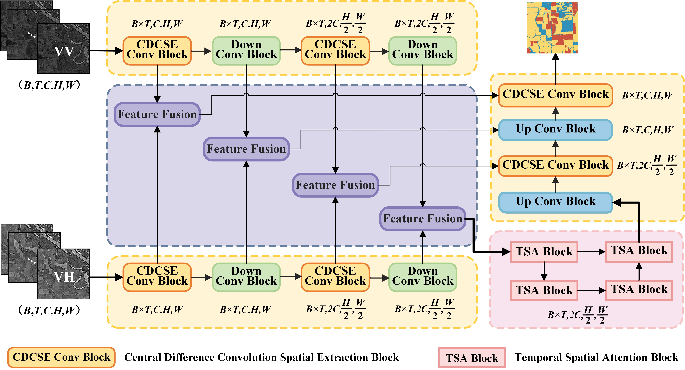

# SimTA

 is an open-source  semantic segmentation toolbox based on PyTorch, [pytorch lightning](https://www.pytorchlightning.ai/) and [timm](https://github.com/rwightman/pytorch-image-models), 
which mainly focuses on developing advanced Vision Transformers for remote sensing image segmentation.


<div>


</div>

## install

Open the folder **airs** using **Linux Terminal** and create python environment:
```
conda create -n airs python=3.8
conda activate airs
pip3 install torch torchvision torchaudio --index-url https://download.pytorch.org/whl/cu118
pip install -r GeoSeg/requirements.txt
```
## Training

"-c" means the path of the config, use different **config** to train different models.

```
python train_supervision.py -c .\config\My\concat\Feature\My.py
```
## Testing

"-c" denotes the path of the config, Use different **config** to test different models. 

"-o" denotes the output path 

```
python vaihingen_test.py -c .\config\My\concat\Feature\My.py -o outputPath 
```
